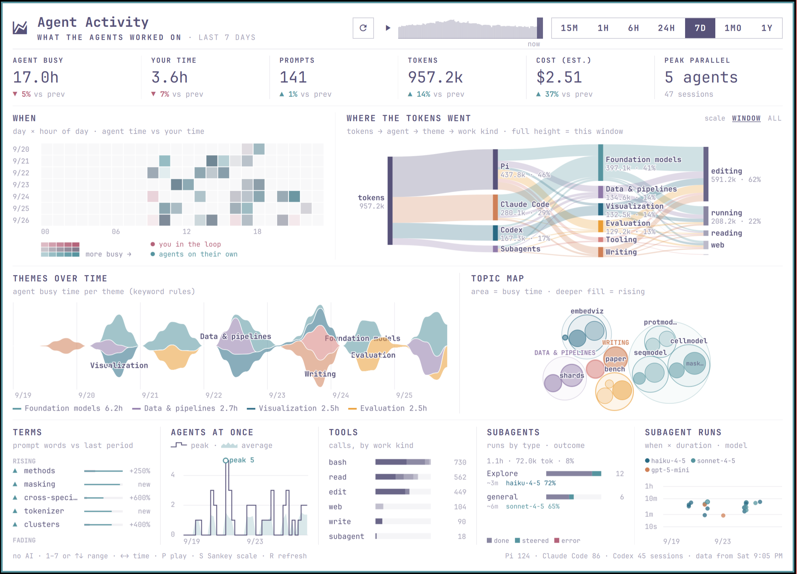
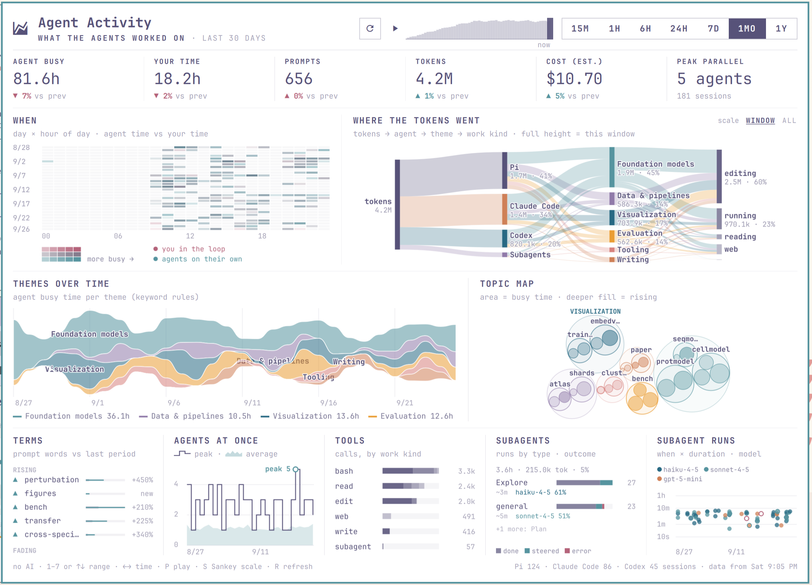

# Agent Activity for Omarchy

A top-bar widget for [Omarchy](https://omarchy.org) (plugin id `agf.agent-activity`, glyph 󰄧) that opens a
large dashboard of what your coding agents worked on: [Pi](https://github.com/badlogic/pi-mono), Claude Code
and Codex. Everything is computed locally from the agents' session logs; nothing is sent anywhere.





*Screenshots use made-up data from `dev/fake_data.py`.*

**Charts:** when (heat map, agent time vs your time) · where the tokens went (Sankey: tokens → agent → theme →
work kind) · themes over time (stream) · topic map (circle pack) · rising/fading terms · agents at once ·
tools by work kind · subagents by type and outcome · subagent runs.

**Time:** ranges 15m · 1h · 6h · 24h · 7d · 1mo · 1y, and a time slider (drag, ←/→, or ▶ play) that replays
any range back through your history. The Sankey can be scaled to the window or to the busiest window ever.

## Requirements

- Omarchy with the Quattro shell (Quickshell).
- `python3` (standard library only) for the collector in `bin/odv.py`.
- Session logs from at least one of: Pi (`~/.pi/agent/sessions/`), Claude Code (`~/.claude/projects/`),
  Codex (`~/.codex/sessions/`). They are only read, never changed.

## Install

```sh
omarchy plugin add https://github.com/angusforbes/omarchy-agent-activity-visualization --enable
```

## Usage

Click the chart icon (󰄧) in the top bar to open the dashboard. The first open reads your session logs
(a few seconds); after that, data refreshes only when you ask: the ↻ button, `R`, or right-click the bar
icon. Nothing runs on a schedule. After a refresh the time slider's windows are built in the background
(up to ~20 s on a large history).

Keys: `1`–`7` or ↑/↓ switch range, ←/→ or `[` `]` move the time slider, `P`/space plays, `S` switches the
Sankey scale, `R` refreshes, Esc closes.

Shell commands:

```sh
omarchy-shell agf.agent-activity toggle
omarchy-shell agf.agent-activity refresh
omarchy-shell agf.agent-activity setRange 1mo
```

## Where the data comes from

The collector reads each agent's session logs where that agent keeps them, honouring the agent's own settings:

| Agent | Default folder | Also honours |
|---|---|---|
| Pi | `~/.pi/agent/sessions/` | `PI_CODING_AGENT_SESSION_DIR`, Pi's `sessionDir` setting, `PI_CODING_AGENT_DIR` |
| Claude Code | `~/.claude/projects/` (or `~/.config/claude/projects/`) | `CLAUDE_CONFIG_DIR` |
| Codex | `~/.codex/sessions/` | `CODEX_HOME` |

Environment variables are read from the shell's environment (set them for your session, not only in a
terminal), so if your logs live elsewhere, the reliable way is `sources` in `config.json` (below). The
panel tells you when it finds no sessions and where it looked; `odv.py check` prints the folders it uses.

## Configure

Move the widget with `omarchy bar move agf.agent-activity --section right`.

Data and settings live in `~/.local/share/omarchy-agent-activity/`: `odv.db` (SQLite), `snapshot.json`,
`frames-*.json` (time-slider windows) and `config.json`, which is created on the first run and can be edited
(press R in the panel afterwards):

- `sources`: session log folders per agent, replacing the defaults above, e.g.
  `"sources": {"claude": ["~/work-machine/.claude/projects"], "codex": ["/data/codex/sessions"]}`.
- `projectRoots`: folders whose sub-folders are your projects (default `~/Work`, `~/code`, `~/projects`,
  `~/src`, `~/dev`, `~/Developer`, `~/repos`, `~/git`, …). A project is named after its folder there;
  otherwise after the session folder's top-level folder under your home.
- `themes` and `themeRules` (theme → regex over prompts, files and folders): the themes in the Sankey,
  stream and topic map. The defaults are generic; add your own projects and keywords.
- `prices`: $ per million tokens, used to estimate cost for Claude Code and Codex (Pi logs record cost).

The collector also works from a terminal: `python3 ~/.config/omarchy/plugins/agf.agent-activity/bin/odv.py run`
(`check` prints sanity numbers per source, `reset` deletes the database, which is rebuilt from the logs).

## Remove

```sh
omarchy plugin remove agf.agent-activity
rm -rf ~/.local/share/omarchy-agent-activity
```

The plugin writes only to `~/.local/share/omarchy-agent-activity/`; removing that folder removes all its data.

## How numbers are defined

- **Turn**: a prompt and everything the agent did until the next prompt.
- **Agent busy**: time inside turns, with gaps over 10 min cut out. Parallel agents add up.
- **Your time**: for each prompt you typed, the time since the agent's last reply (at most 3 min),
  unioned across sessions. Prompts relayed from other agents and subagent sessions are not counted as yours.
- **Tokens / cost**: from each log's usage fields. Pi records cost; Claude Code and Codex costs are
  estimated from `prices` in `config.json` (shown as "COST (EST.)").
- **Duplicates**: forked Pi sessions copy their parent's history; copied entries are counted once.
- **Work kind**: from each turn's tool calls: editing, running commands, reading, web, delegating, talking.
- **Topic**: from the folders and files a turn touched. **Terms**: words from your prompts, weighted by
  rarity (tf-idf), compared with the previous period of the same length.

## Subagents

- **Pi `Agent` / `SubagentWorkflow` children** have their own session files (`parentSession` in the header),
  which give their type, busy time, tokens and cost. Each run is also recorded in the parent
  (`subagents:record`: type, description, status, start/end).
- **Pane subagents** (`subagent` tool): `subagent_result` messages give name, status and duration.
- **Claude Code**: `Agent`/`Task` tool calls and `subagents/*.jsonl` sessions.
- Codex logs contain no subagents. The Sankey shows subagent tokens as their own "Subagents" agent.

## Optional: AI tagging with Jev

The widget itself never uses AI. The collector can optionally tag turns with
[Jev](https://typesafe.ai) (TypeSafe) for other tools: `python3 bin/odv.py tag --jev`. This **sends prompts,
the agent's first reply and the files touched to api.typesafe.ai**, one request per turn, so it runs only
when you ask and only with your own key in `TYPESAFE_API_KEY` (or `~/.pi/agent/secrets/typesafe_api_key`).

## Development

- `dev/fake_data.py` writes a made-up data set to `dev/fake-data/`; show it in the panel with
  `omarchy-shell agf.agent-activity useData "$PWD/dev/fake-data"` and switch back with `useRealData`.
- `dev/index.html` previews the charts in a browser:
  `chromium --allow-file-access-from-files "dev/index.html?snap=file://$HOME/.local/share/omarchy-agent-activity/snapshot.json"`.
- `charts.js` holds all chart drawing (Canvas 2D), shared by the panel and the dev page.

## License

[MIT](LICENSE)
